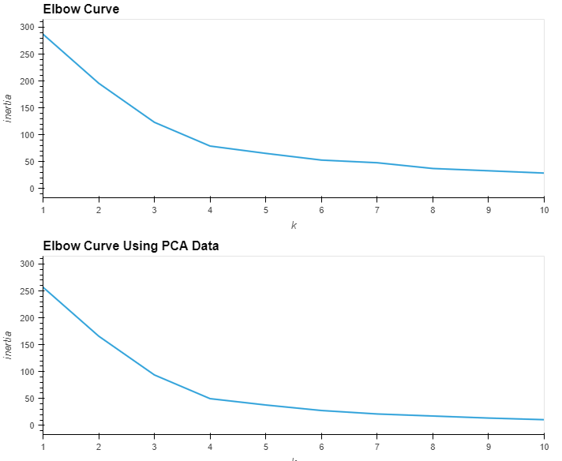
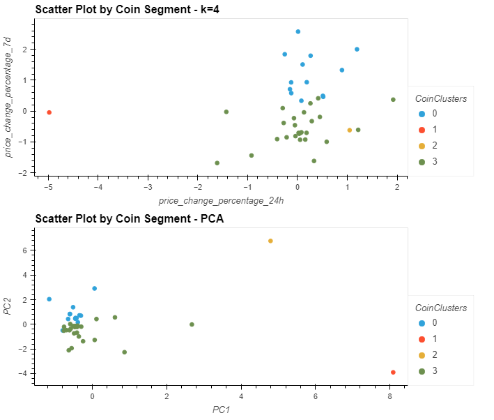

# CryptoClustering
This is my submission for the DA Bootcamp Module 19 Challenge-Unsupervised Machine Learning

In this challenge, I utilized Python and unsupervised learning to predict if cryptocurrencies are affected by 24-hour or 7-day price changes. I found the ideal value of k using the elbow method, and then used PCA to streamline the data for clean clustering results. I was then able to visualize the original clustering as well as the clustering after PCA using hvplots.

## Elbow Line Graphs

## Scatter Plot Clustering

I referenced class activities and instruction provided by Instructor Brett Barnes and TA Ally Qi to complete this activity.
